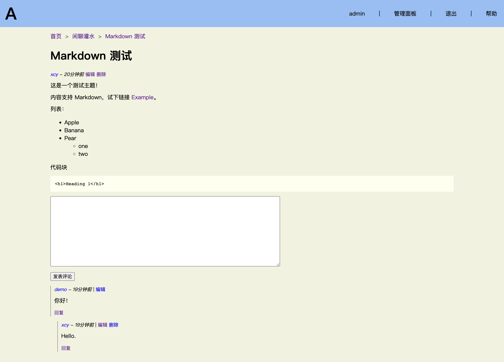
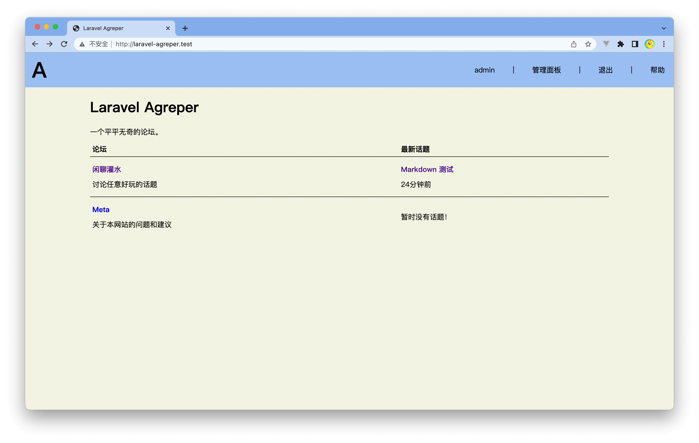
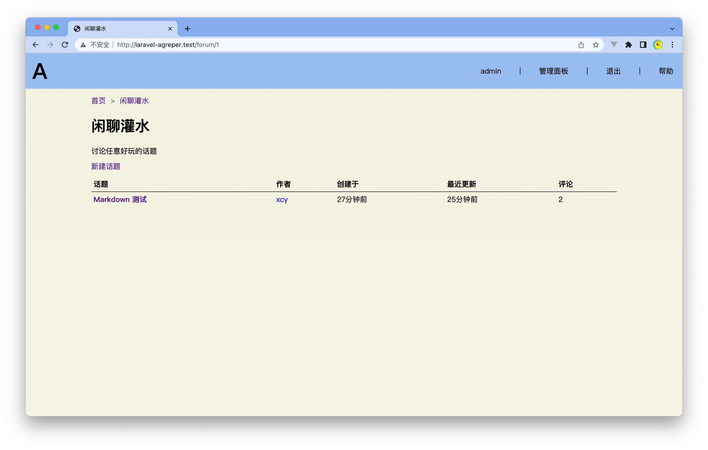
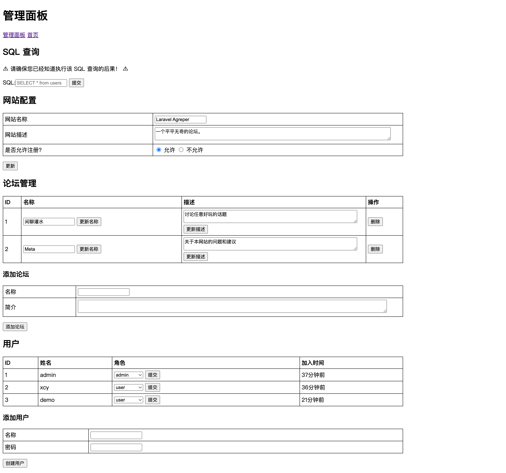

# laravel-agreper - 极简、无需 JS 的论坛

[Demo](https://laravel-agreper.xuchunyang.cn/)

laravel-agreper 的灵感来自 [agreper](https://github.com/Demindiro/agreper)，我的初衷是学习 Laravel 框架。

## 安装并运行

> 如果用过 Laravel，这些步骤会很轻松。

请首先确保你已经安装好了 PHP 8。

下载代码：

    git clone https://github.com/xuchunyang/laravel-agreper.git
    cd laravel-agreper

安装依赖：

    composer install

获得本地配置文件：

    cp .env.example .env

编辑 `.env` 文件，设置数据库，比如 SQLite：

    # env
    DB_CONNECTION=sqlite
    DB_DATABASE=/Users/xcy/src/laravel-agreper/database/database.sqlite

生成密钥：

    php artisan key:generate

新建数据库表：

    php artisan migrate

填充必备的数据，包括设置管理员账户：

    ➜  laravel-agreper git:(main) ✗ php artisan db:seed
    
    INFO  Seeding database.
    
    [2022-10-16 16:27:51] local.INFO: 创建网站设置
    [2022-10-16 16:27:51] local.INFO: 创建示例论坛【闲聊灌水】
    管理员用户名: admin
    管理员密码: 123456
    [2022-10-16 16:28:54] local.INFO: 管理员创建成功

运行网站：

    php artisan serve

## 升级

    git pull
    composer install
    php artisan migrate

## 截图

### 首页（论坛列表页）

### 论坛

### 管理面板

